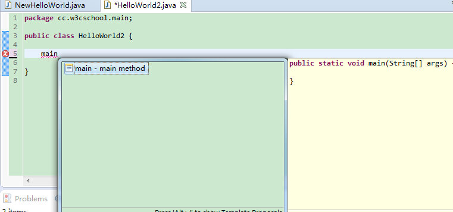
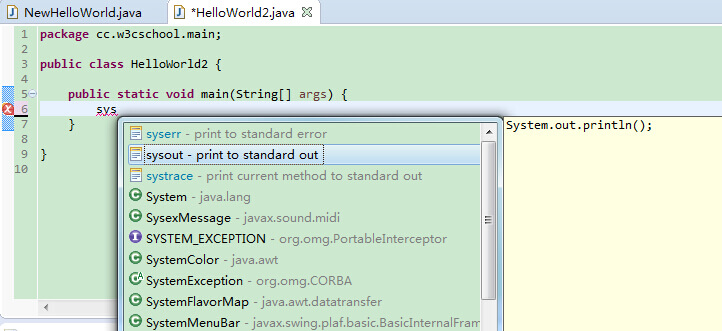
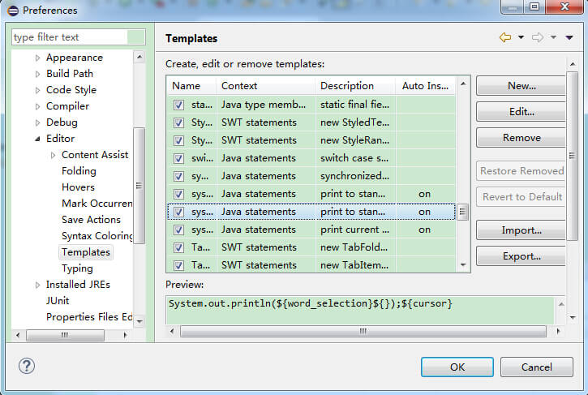
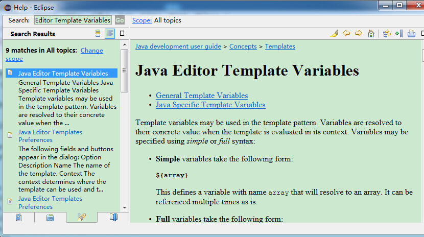

# Eclipse 代码模板

## 使用代码模板

Eclipse 提供了通过定义和使用代码模板来提高工作效率与代码可预测性的能力。

我们在开发 Java 程序过程中经常需要编写 main 方法：

```
    public static void main(String[]args) {

    }
```

如果我们一个字母一个字母去编写，将是一个重复而又毫无意义的事情，这是我们就可以使用 Eclipse 代码模板来快速完成这些工作。

我们只需在类体中键入main，然后使用Eclipse的代码提示快捷键(默认为Alt+/)，回车后，就可以看到Eclipse自动帮我们完成了main函数的完整定义：

 

如果我们要使用 System.out.println()，我们只需要输入 syso 然后按下 Alt+/ 即可：

 


## 自定义代码模板

Eclipse 还提供了非常多的代码模板，我们可以通过 Windows->Preferences->Java->Editor->Templates (你可以在搜索框中输入Templates查找)看到所有已定义的代码模板列表。

 

我们在弹窗口选中 sysout 模板并点击右侧Edit，显示如下：

 

编辑面板是核心关注对象，因为一切东西都在这里面配置。先来熟悉下这个面板中关键的五项分别是什么。

* **Name：**名称，其实就是以后可以用到的代码缩写
* **Context：**模板上下文，指定该代码模板在什么地方才能生效，对于Java至少包含这么四个：
    1. Java type members，模板对应的代码是类成员，psvm模板严格来说应该选择这个
* Java statements，模板对应的代码是语句块
* Java，最通用的，只要是Java代码就行
* Java doc，顾名思义了
* **模板变量：**eclipse已经预置了一些模板变量（点Insert Varibles可以看到所有预置变量），如：
    1. ${cursor}是表示光标
    2. ${date}表示当前日期字符串
    3. ${time}表示当前时间字符串
    4. ${line_selection}让当前行被选中
    5. ${word_selection}让当前单词被选中
当然我们也可以定义自己的模板变量，比如我定义一个 ${myTemplateVarible}，那么对应代码显示的就是 myTemplateVarible。
* **Pattern：**代码模板对应的模式，按照你希望代码的格式逐个输入即可

更多自定义代码模板的内容你可以通过点击 Help 菜单中的 Help Contents 选项，在弹出的对话框的搜索栏上输入 "Java Editor Template Variables" 选择 Java Editor Template Variables 查看具体的文档描述：

 
