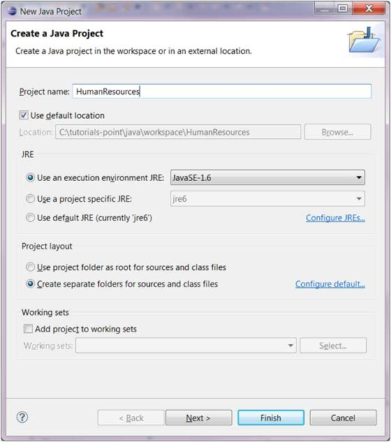

# Eclipse 创建 Java 项目

## 打开新建 Java 项目向导

通过新建 Java 项目向导可以很容易的创建 Java 项目。打开向导的途径有：

* 通过点击 "File" 菜单然后选择 New > Java Project
* 在项目浏览器(Project Explorer)窗口中鼠标右击任一地方选择 New > Java Project
* 在工具条上点击新建按钮  并选择 Java Project

## 使用新建 Java 项目向导

新建 Java 项目向导有两个页面。

第一个页面:

* 输入项目名称（Project Name 栏中）
* 选择 Java Runtime Environment (JRE) 或直接采用默认的
* 选择项目布局（Project Layout），项目布局决定了源代码和 class 文件是否放置在独立的文件夹中。 推荐的选项是为源代码和 class 文件创建独立的文件夹。

 

你可以点击"Finish" 按钮来创建项目或点击"Next" 按钮来修改 java 构建的配置。

第二个页面 [Java 构建路径设置（Java Build Settings ）](eclipse-java-build-path.md)，该页面我们可以配置项目的依赖关系及额外的 jar 包。

## 查看新建项目

Package Explorer 显示了新建的 Java 项目。项目图标中的 "J" 字母表示 Java 项目。 文件夹图标表示这是一个 java 资源文件夹。

