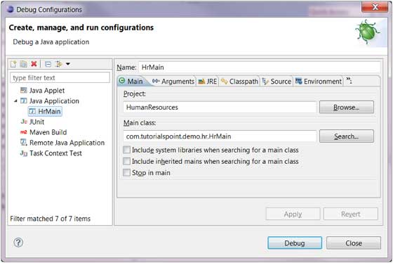
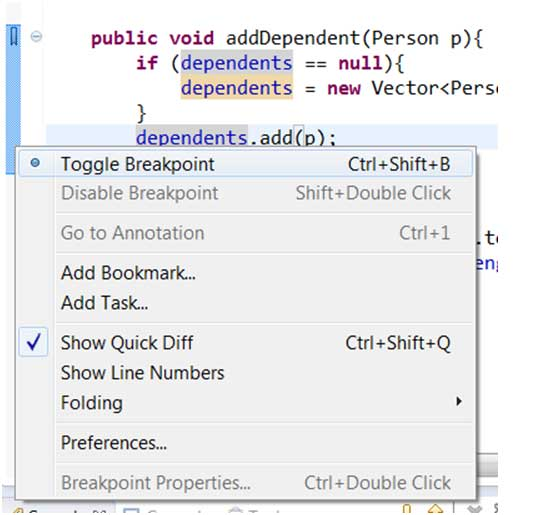
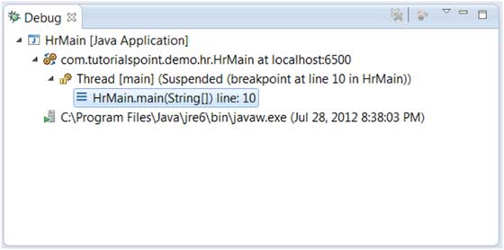
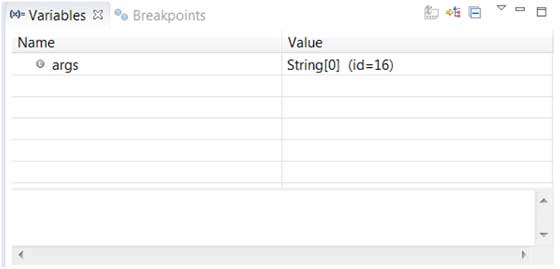
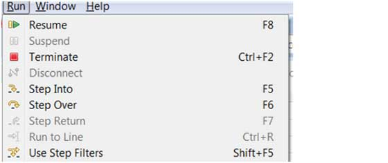

# Eclipse Debug 调试

## Debug 调试 Java 程序

我们可以在 Package Explorer 视图调试 Java 程序，操作步骤如下：

* 鼠标右击包含 main 函数的 java 类
* 选择 Debug As > Java Application

该操作也可以通过快捷键来完成，快捷键组合为 Alt + Shift + D, J。

以上操作会创建一个新的 [Debug Configuration（调试配置）](eclipse-debug-configuration.md) ，并使用该配置来启动 Java 应用。

如果 Debug Configuration（调试配置）已经创建，你可以通过 Run 菜单选择 Debug Configurations 选取对应的类并点击 Debug 按钮来启动 Java 应用。

 

Run 菜单的 Debug 菜单项可以重新加载之前使用了调试模式的 java 应用。

 

重新加载之前使用了调试模式的 java 应用快捷键为 F11。

当使用调试模式开启java程序时，会提示用户切换到调试的透视图。调试透视图提供了其他的视图用于排查应用程序的故障。

java 编辑器可以设置断点调试。 在编辑器中右击标记栏并选择 Toggle Breakpoint 来设置断点调试。

 

断点可以在标记栏中看到。也可以在 Breakpoints View（断点视图）中看到。

当程序执行到断点标记的代码时 JVM 会挂起程序，这时你可以查看内存使用情况及控制程序执行。

程序挂起时，Debug(调试)视图可以检查调用堆栈。

 

variables(变量)视图可以查看变量的值。

 

Run 菜单中有继续执行(Resume)菜单项，跳过(Step Over)一行代码，进入函数(Step Into)等。

 

以上图片中显示了 Resume, Step Into 和 Step Over 等关联的快捷键操作。