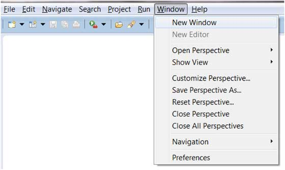

# Eclipse 菜单

Eclipse 查看的菜单栏通常包含以下几个菜单：

* File 菜单
* Edit 菜单
* Navigate 菜单
* Search 菜单
* Project 菜单
* Run 菜单
* Window 菜单
* Help 菜单

    
通过 Eclipse 插件你可以添加新的菜单和菜单项。

## 菜单描述 

<table > <tbody><tr><th>菜单名</th><th>描述</th></tr> <tr><td>File</td><td> File 菜单运行你打开文件，关闭编辑器，保存编辑的内容，重命名文件。 此外还可以导入和导出工作区的内容及关闭 Eclipse。</td></tr> <tr><td>Edit</td><td> Edit 菜单有复制和粘贴等功能。</td></tr> <tr><td>Source</td><td>只有在打开 java 编辑器时 Source 菜单才可见。 Source 菜单关联了一些关于编辑 java 源码的操作。</td></tr> <tr><td>Navigate</td><td> Navigate 菜单包含了一些快速定位到资源的操作。</td></tr> <tr><td>Search</td><td> Search 菜单可以设置在指定工作区对指定字符的搜索。</td></tr> <tr><td>Project</td><td>Project 菜单关联了一些创建项目的操作。</td></tr> <tr><td>Run</td><td>Run 菜单包含了一些代码执行模式与调试模式的操作。 </td></tr> <tr><td>Window</td><td> Window 菜单允许你同时打开多个窗口及关闭视图。 Eclipse 的参数设置也在该菜单下。</td></tr> <tr><td>Help</td><td> Help 菜单用于显示帮助窗口，包含了 Eclipse 描述信息，你也可以在该菜单下安装插件。</td></tr> </tbody></table>

Eclipse 也可以自定义菜单，自定义菜单的详细介绍可以查看[Eclipse 透视图](eclipse-perspectives.md). 
