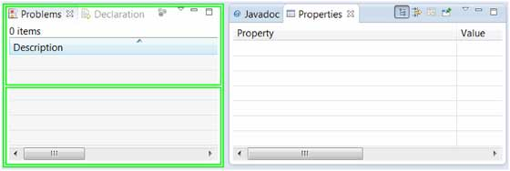
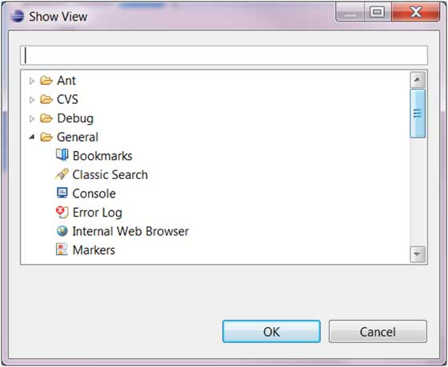

# Eclipse 视图(View)

## 关于视图

Eclipse视图允许用户以图表形式更直观的查看项目的元数据。 例如，项目导航视图中显示的文件夹和文件图形表示在另外一个编辑窗口中相关的项目和属性视图。

Eclipse 透视图(perspective) 可以显示任何的视图和编辑窗口。

所有的编辑器实例出现在一个编辑器区域内，可以通过文件夹视图查看。

一个工作台窗口可以显示任意数量的文件夹视图。每个文件夹视图可以显示一个或多个视图。

## 组织视图

下图显示了文件夹视图的四个视图。

下图在两个文件夹视图中显示四个视图。

## 移除视图 views

视图从一个文件夹视图移动到另外一个文件夹视图只需要点击视图标题并推动视图工具区域到另外一个文件夹视图。

## 创建文件夹视图

文件夹视图可以通过移动视图标题栏到编辑去外或移动标题栏到另外一个文件夹视图来动态创建。 下图中如果你拖动了绿色线框内的标题栏意味着一个新的文件夹视图将被创建。

移动拖动图标到窗口的底部，您可以创建一个横跨窗口整个宽度的视图文件夹。移动拖动图标到窗口的左边或右边，您可以创建一个横跨窗口的整个高度视图文件夹。

## 操作视图

你可以在 Window 菜单中点击 "Show View" 选项打开其他视图。

点击 "Other" 菜单选项会弹出一个 "Show View" 对话框，对话框中你可以查找和激活视图。

视图通过各个分类来组织。你可以通过搜索框快速查找视图。 然后打开视图并选择，点击 "OK" 按钮即可。