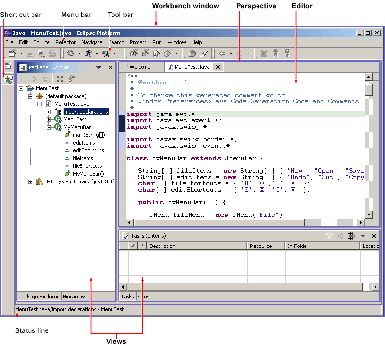

# Eclipse 窗口说明

## Eclipse 工作台(Workbench)

首先，让我们来看一下Eclipse 作台用户界面，和它里面的各种组件。

工作台是多个窗口的集合。每个窗口包含菜单栏，工具栏，快捷方式栏，以及一个或者多个透视图。

透视图是一个包含一系列视图和内容编辑器的可视容器。

视图完全存在于某个透视图中而且不能被共享，而任何打开的内容编辑器可以在透视图间共享。

如果两个或者多个透视图打开了同样的视图，他们共享这个视图的同一个实例，虽然在不同透视图之间视图的布局可能不同。

对于不同的工作台窗口中的透视图，编辑器和视图都不能共享。

一个透视图就好像是一本书里面的一页。它存在在一个窗口中，并且和其他透视图一起存在，和书中的一页一样，每次你只能看到一个透视图。

工作台的主菜单栏通常包括File，Edit，Navigate，Project，Window，Help这些顶层菜单。

其他的顶层菜单位于Edit和Project菜单之间，往往是和上下文相关，这个上下文包括当前活动的透视图，最前面的编辑器以及活动视图。

在File菜单中，你可以找到一个New子菜单，它包括Project，Folder，File的创建菜单项。

File 菜单也包含Import and Export菜单项，用来导入文件到Wrokbench中，以及导出它们。

在Edit菜单中，你可以找到象Cut，Copy，Paste，和Delete这些命令。这些命令称为全局命令，作用于活动部件。

也就是说，如果当Navigator活动时使用Delete命令, 实际操作是由Navigator完成的。

在Project菜单中，你可以找到和项目相关的命令，比如Open Project，Close Project和Rebuild Porject等。

在Run菜单中，你可以看到和运行，调试应用代码相关的命令，以及启动象Ant脚本这样的外部工具。

在Window菜单中，你可以找到Open Perspective子菜单，根据你开发任务的需要打开不同的透视图。

你也能看到透视图 布局管理菜单栏。Show View子菜单用来在当前的Workbench窗口中增加视图。

另外，你可以通过首选项菜单项来修改工作台的功能首选项配置。

如果你是插件开发者，你可以为平台提供新的视图，编辑器，向导，菜单和工具项。 这些东西都是用XML来定义的，插件一旦注册后，就可以和平台中已经存在的组件无缝地集成在一起。

## Eclipse 多窗口

Eclipse 可以同时开启多个窗口，在 菜单栏选择： Window -> New Window 来开启多窗口。

多个窗口的切换你可以使用 Alt + Tab 来回切。
