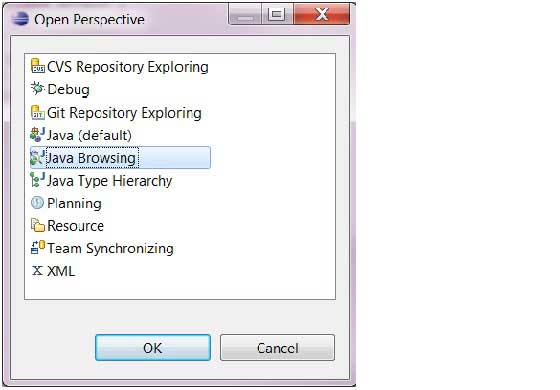
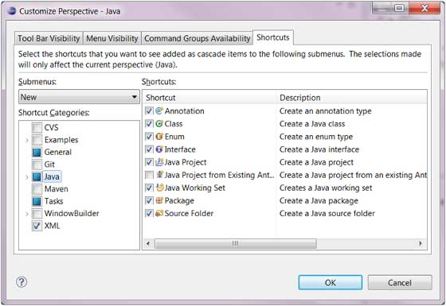

# Eclipse 透视图(Perspective)

## 什么是透视图？

透视图是一个包含一系列视图和内容编辑器的可视容器。默认的透视图叫 java。

Eclipse 窗口可以打开多个透视图，但在同一时间只能有一个透视图处于激活状态。

用户可以在两个透视图之间切换。

## 操作透视图

通过"Window"菜单并选择"Open Perspective > Other"来打开透视图对话框。

透视图对话框中显示了可用的透视图列表。

该透视图列表也可以通过工具栏上的透视图按钮来打开  。

## 视图切换

大都数情况下 java 开发者会使用 Java 透视图和 Debug 透视图。你可以通过工具条上的透视图名称来自由切换。

## 关闭透视图

工具条上右击透视图名及选择"Close"项即可关闭透视图。

## 自定义透视图

我们可以通过自定义透视图窗口来设置我们想要的透视图。

* 点击菜单栏上的 "Windows" => "Customize Perspective" => 弹出窗口，可以在"Submenus"里面选择你要设置的内容。
* "New" => 设置你的新建菜单，可以把你平时需要新建的最常用的文件类型选中。
* "Show Views" 在你自定义的这个视图的布局，也就是切换到你自己的视图后，会出现哪些窗口。根据自己习惯进行设置。
* Open Perspective" => 切换视图菜单中，出现哪些可以选择的视图。
* 都设置好以后，保存你的自定义透视图。Windows => Save Perspective as，然后为你自定义的透视图取一个名字，保存。

