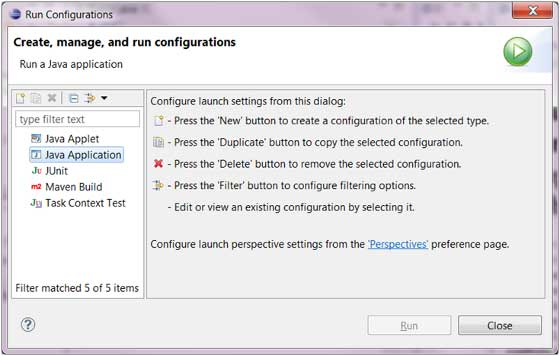
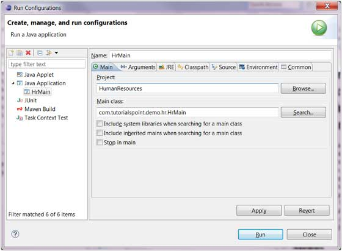
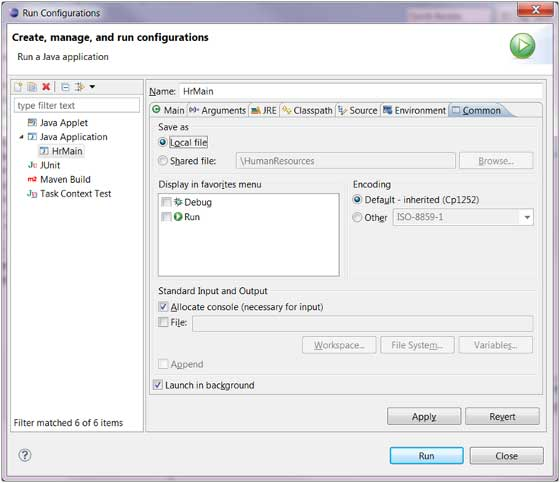

# Eclipse 运行配置(RunConfiguration)

## 创建和使用 Eclipse 运行配置

在运行配置(Run Configuration)对话框中可以创建多个运行配置。每个配置可以在应用中启用。

运行配置(Run Configuration)对话框可以通过 Run 菜单中选择 Run Configurations 来调用。

 

如果要给 Java 应用创建运行配置需要在左侧列表中选择 "Java Application" 并点击 New 按钮。

对话框中描述的项有：

* 运行配置名称
* 项目名
* 主类名

Arguments(参数)项有：

* Program arguments(程序参数) 可以 0 个或多个
* VM arguments(Virtual Machine arguments:虚拟机参数) 可以 0 个或多个

 

Commons 选项卡中提供了通用配置，如标准输入输出的选项，可以到控制台或指定文件。

 

点击 Apply(提交) 按钮保存运行配置并点击 Run(运行) 按钮重新执行 Java 应用。
