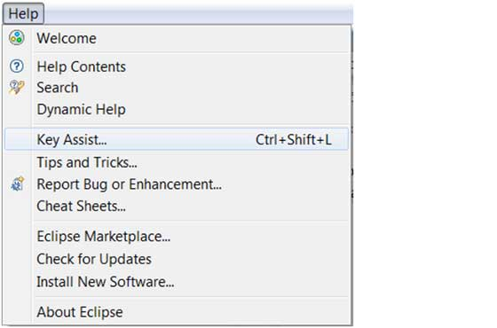
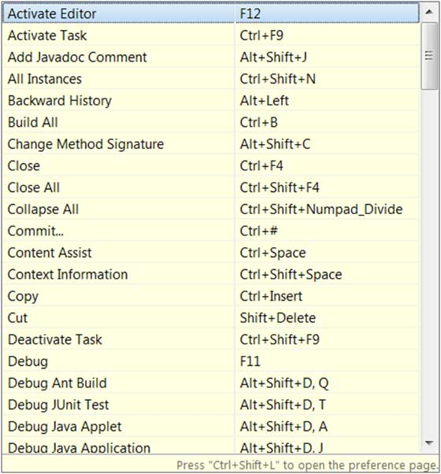
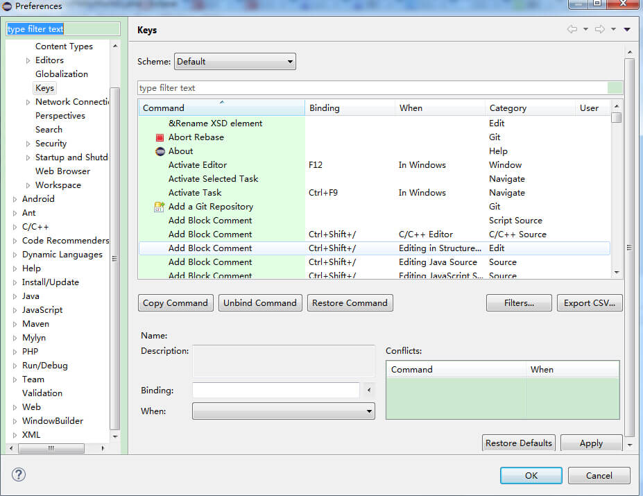
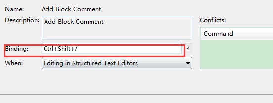
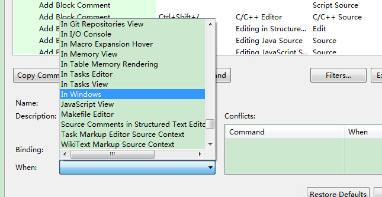

# Eclipse 快捷键

## 关于快捷键

Eclipse 的很多操作都提供了快捷键功能，我们可以通过键盘就能很好的控制 Eclipse 各个功能：

*   使用快捷键关联菜单或菜单项
*   使用快捷键关联对话窗口或视图或编辑器
*   使用快捷键关联工具条上的功能按钮

Eclipse 快捷键列表可通过快捷键 Ctrl + Shift + L 打开 。

## 设置快捷键

Eclipse 系统提供的快捷键有时比较难记住，甚至根本没有提供快捷键时，就需要自己手动设置快捷键。

我们可以通过点击window->preferences->general->keys（或直接搜索keys），进入快捷键管理界面：

在这里可以查找所有功能的快捷键，需要修改或新增时，点击需要修改或新增的命令，在 binding 里设置快捷键:

设置完快捷键后，还需要设置在什么时候可以使用该快捷键，eclipse提供各种场景供选择，一般选择In Windows(即在eclipse窗口激活状态)即可。

完成以上操作，点击 OK 按钮即完成设置。

## Eclipse 常用快捷键

<table > <tr> <th>快捷键</th><th>描述</th></tr> <tr><th colspan="2"> 编辑</th></tr> <tr><td> Ctrl+1 </td><td>快速修复（最经典的快捷键,就不用多说了，可以解决很多问题，比如import类、try catch包围等）</td></tr><tr><td> Ctrl+Shift+F </td><td> 格式化当前代码</td></tr><tr><td> Ctrl+Shift+M </td><td> 添加类的import导入</td></tr><tr><td> Ctrl+Shift+O </td><td> 组织类的import导入（既有Ctrl+Shift+M的作用，又可以帮你去除没用的导入，很有用）</td></tr><tr><td> Ctrl+Y </td><td> 重做（与撤销Ctrl+Z相反）</td></tr><tr><td> Alt+/ </td><td> 内容辅助（帮你省了多少次键盘敲打，太常用了）</td></tr><tr><td> Ctrl+D </td><td> 删除当前行或者多行</td></tr><tr><td> Alt+↓ </td><td> 当前行和下面一行交互位置（特别实用,可以省去先剪切,再粘贴了）</td></tr><tr><td> Alt+↑ </td><td>当前行和上面一行交互位置（同上）</td></tr><tr><td> Ctrl+Alt+↓ </td><td>复制当前行到下一行（复制增加）</td></tr><tr><td> Ctrl+Alt+↑ </td><td>复制当前行到上一行（复制增加）</td></tr><tr><td> Shift+Enter </td><td>在当前行的下一行插入空行（这时鼠标可以在当前行的任一位置,不一定是最后）</td></tr><tr><td> Ctrl+/ </td><td>注释当前行,再按则取消注释</td></tr> <tr><th colspan="2">选择</th></tr><tr><td> Alt+Shift+↑ </td><td>选择封装元素</td></tr><tr><td> Alt+Shift+← </td><td>选择上一个元素</td></tr><tr><td> Alt+Shift+→ </td><td>选择下一个元素</td></tr><tr><td> Shift+← </td><td>从光标处开始往左选择字符</td></tr><tr><td> Shift+→ </td><td>从光标处开始往右选择字符</td></tr><tr><td> Ctrl+Shift+← </td><td>选中光标左边的单词</td></tr><tr><td> Ctrl+Shift+→ </td><td>选中光标又边的单词</td></tr> <tr><th colspan="2">移动</th></tr><tr><td> Ctrl+← </td><td>光标移到左边单词的开头，相当于vim的b</td></tr><tr><td> Ctrl+→ </td><td>光标移到右边单词的末尾，相当于vim的e</td></tr> <tr><th colspan="2">搜索</th></tr><tr><td> Ctrl+K </td><td>参照选中的Word快速定位到下一个（如果没有选中word，则搜索上一次使用搜索的word）</td></tr><tr><td> Ctrl+Shift+K </td><td>参照选中的Word快速定位到上一个</td></tr><tr><td> Ctrl+J </td><td>正向增量查找（按下Ctrl+J后,你所输入的每个字母编辑器都提供快速匹配定位到某个单词,如果没有,则在状态栏中显示没有找到了,查一个单词时,特别实用,要退出这个模式，按escape建）</td></tr><tr><td> Ctrl+Shift+J </td><td>反向增量查找（和上条相同,只不过是从后往前查）</td></tr><tr><td> Ctrl+Shift+U </td><td>列出所有包含字符串的行</td></tr><tr><td> Ctrl+H </td><td>打开搜索对话框</td></tr><tr><td> Ctrl+G </td><td>工作区中的声明</td></tr><tr><td> Ctrl+Shift+G </td><td>工作区中的引用</td></tr> <tr><th colspan="2">导航</th></tr><tr><td> Ctrl+Shift+T </td><td>搜索类（包括工程和关联的第三jar包）</td></tr><tr><td> Ctrl+Shift+R </td><td>搜索工程中的文件</td></tr><tr><td> Ctrl+E </td><td>快速显示当前Editer的下拉列表（如果当前页面没有显示的用黑体表示）</td></tr><tr><td> F4</td><td> 打开类型层次结构</td></tr><tr><td> F3</td><td>跳转到声明处</td></tr><tr><td> Alt+← </td><td>前一个编辑的页面</td></tr><tr><td> Alt+→ </td><td>下一个编辑的页面（当然是针对上面那条来说了）</td></tr><tr><td> Ctrl+PageUp/PageDown </td><td>在编辑器中，切换已经打开的文件</td></tr> <tr><th colspan="2">调试</th></tr><tr><td> F5 </td><td>单步跳入</td></tr><tr><td> F6 </td><td>单步跳过</td></tr><tr><td> F7 </td><td>单步返回</td></tr><tr><td> F8 </td><td>继续</td></tr><tr><td> Ctrl+Shift+D </td><td>显示变量的值</td></tr><tr><td> Ctrl+Shift+B </td><td>在当前行设置或者去掉断点</td></tr><tr><td> Ctrl+R </td><td>运行至行(超好用，可以节省好多的断点)</td></tr> <tr><th colspan="2">重构（一般重构的快捷键都是Alt+Shift开头的了）</th></tr><tr><td> Alt+Shift+R </td><td>重命名方法名、属性或者变量名 （是我自己最爱用的一个了,尤其是变量和类的Rename,比手工方法能节省很多劳动力）</td></tr><tr><td> Alt+Shift+M </td><td>把一段函数内的代码抽取成方法 （这是重构里面最常用的方法之一了,尤其是对一大堆泥团代码有用）</td></tr><tr><td> Alt+Shift+C </td><td>修改函数结构（比较实用,有N个函数调用了这个方法,修改一次搞定）</td></tr><tr><td> Alt+Shift+L </td><td>抽取本地变量（ 可以直接把一些魔法数字和字符串抽取成一个变量,尤其是多处调用的时候）</td></tr><tr><td> Alt+Shift+F</td><td> 把Class中的local变量变为field变量 （比较实用的功能）</td></tr><tr><td> Alt+Shift+I </td><td>合并变量（可能这样说有点不妥Inline）</td></tr><tr><td> Alt+Shift+V </td><td>移动函数和变量（不怎么常用）</td></tr><tr><td> Alt+Shift+Z </td><td>重构的后悔药（Undo）</td></tr> <tr><th colspan="2">其他</th></tr><tr><td> Alt+Enter </td><td>显示当前选择资源的属性，windows下的查看文件的属性就是这个快捷键，通常用来查看文件在windows中的实际路径</td></tr><tr><td> Ctrl+↑ </td><td>文本编辑器 上滚行</td></tr><tr><td> Ctrl+↓ </td><td>文本编辑器 下滚行</td></tr><tr><td> Ctrl+M </td><td>最大化当前的Edit或View （再按则反之）</td></tr><tr><td> Ctrl+O</td><td> 快速显示 OutLine（不开Outline窗口的同学，这个快捷键是必不可少的）</td></tr><tr><td> Ctrl+T </td><td>快速显示当前类的继承结构</td></tr><tr><td> Ctrl+W </td><td>关闭当前Editer（windows下关闭打开的对话框也是这个，还有qq、旺旺、浏览器等都是）</td></tr><tr><td> Ctrl+L </td><td>文本编辑器 转至行</td></tr><tr><td> F2 </td><td>显示工具提示描述</td></tr></table> 

