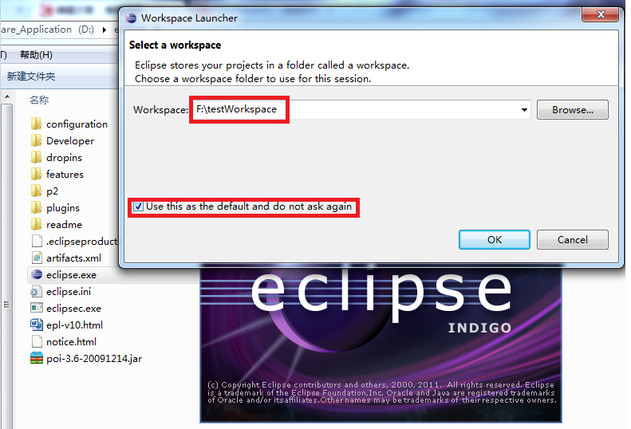
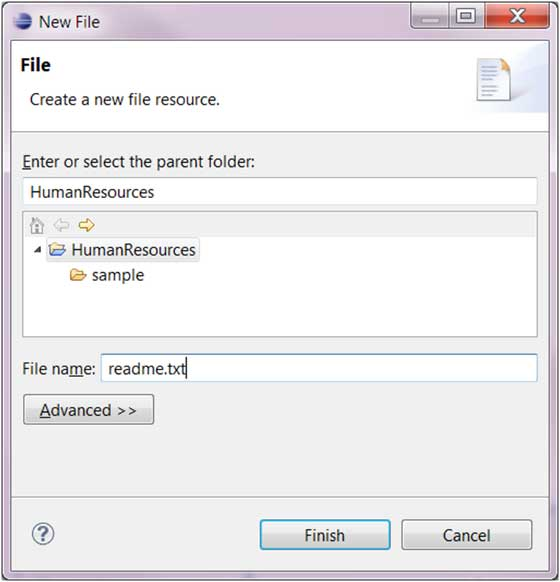
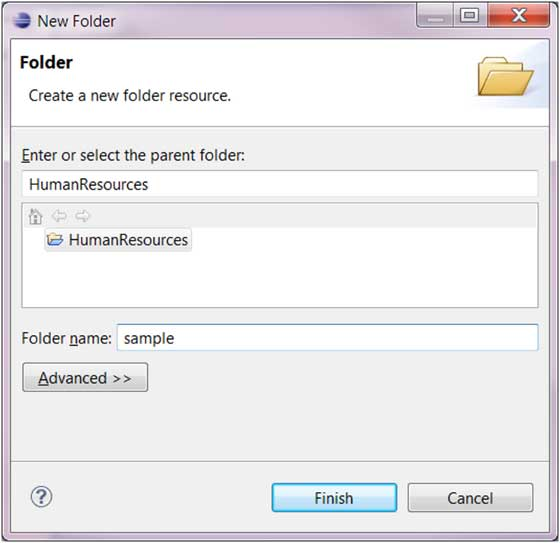
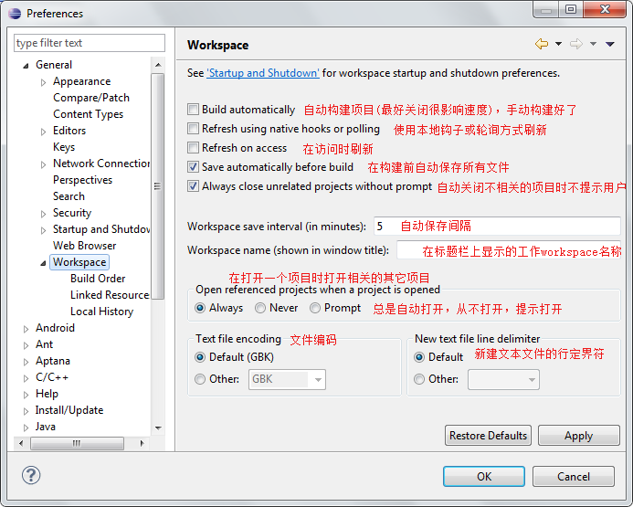
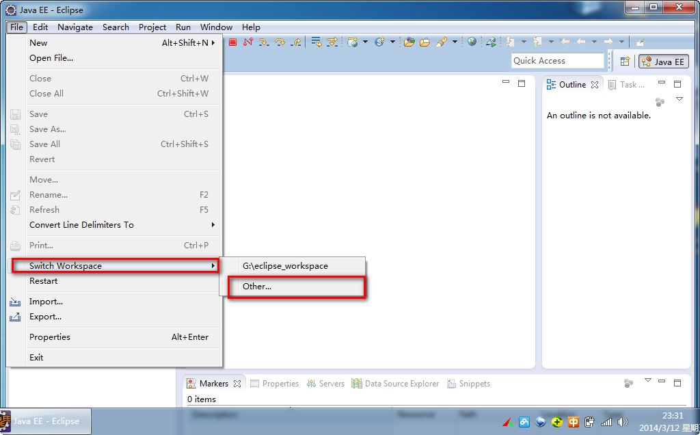

# Eclipse 工作空间(Workspace)

eclipse 工作空间包含以下资源：

项目启动时一般可以设置工作空间，你可以将其设置为默认工作空间，下次启动后无需再配置：

工作空间(Workspace)有明显的层次结构。 项目在最顶级，项目里头可以有文件和文件夹。

插件可以通过资源插件提供的API来管理工作空间的资源。

## 管理工作空间(Workspace)

用户通过使用视图，编辑器和向导功能来创建和管理工作空间中的资源。其中，显示工作区的内容很多意见中的Project Explorer视图。显示项目工作空间内容的视图是Project Explorer视图。

文件创建向导(File > New > File) 。

文件夹(Folder)创建向导(File > New > Folder) 。

## 工作空间（workspace）设置

在菜单栏上选择 "Window" => "preferences..." => "General"=>"Workspace"，设置说明如下图：

## Eclipse切换工作空间(workspace)

Eclipse切换工作空间可以选择菜单栏中选择 "File" => "switch workspace"：

